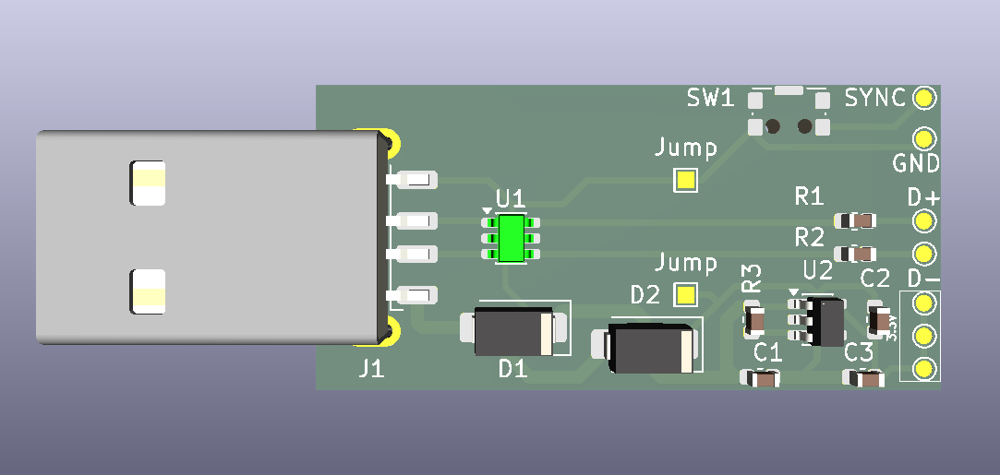

# USB_TVS-WII-MOD
# Adaptador de Módulo con Protección USB

> [!NOTE]
> **Estado del Proyecto: Trabajo en Progreso (WIP)**
> La estructura y especificaciones están definidas. Los esquemáticos, ruteos de PCB y archivos (Gerbers) serán liberados y subidos a las carpetas correspondientes una vez que el diseño esté finalizado y validado.

## Descripción General

Diseño de un adaptador USB enfocado en la reconversión de un módulo Bluetooth reciclado para su operación como dispositivo HID estándar en PC. El circuito actúa como interfaz física y etapa de protección: implementa matrices de diodos TVS para aislar el hardware contra (ESD) y sobretensiones transitorias, asegurando la integridad de las líneas de datos.

## Especificaciones Técnicas y Topología

### Componentes Críticos
* **Protección ESD/Sobretensión:** Implementación de la matriz de diodos TVS **USBLC6-2SC6**. Seleccionada específicamente por su baja capacitancia, lo que evita la degradación y distorsión en las líneas de datos del bus USB.
* **Acondicionamiento de Señal:** Resistencias en serie en las líneas D+ y D- para acoplar la impedancia, mitigar reflexiones y realizar un filtrado pasivo de ruido de alta frecuencia.
* **Alimentación Limpia:** Regulador LDO integrado para estabilizar el voltaje proveniente de VBUS y entregar una alimentación aislada a 3.3V y de bajo ruido al módulo conectado.

### Consideraciones de PCB
* **Ruteo Diferencial:** Las líneas D+ y D- están ruteadas respetando las reglas de pares diferenciales para evitar desfasajes en la comunicación.
* **Gestión de Tierras y Blindaje (Shield):** Diseño enfocado en evitar bucles de masa, con un plano de tierra y tratamiento físico del shield para derivar correctamente las descargas externas sin afectar el circuito lógico.

## Estructura del Repositorio
* `/Hardware`: Archivos fuente del diseño EDA (KiCad).
* `/Gerbers`: Archivos comprimidos. 
* `/Docs`: Esquemáticos en formato PDF y datasheets técnicos.
* `BOM.csv`: Lista de materiales con designadores, encapsulados y valores.

---
*Distribuido bajo [CC BY-NC-SA 4.0](https://creativecommons.org/licenses/by-nc-sa/4.0/deed.es) — uso no comercial.*
